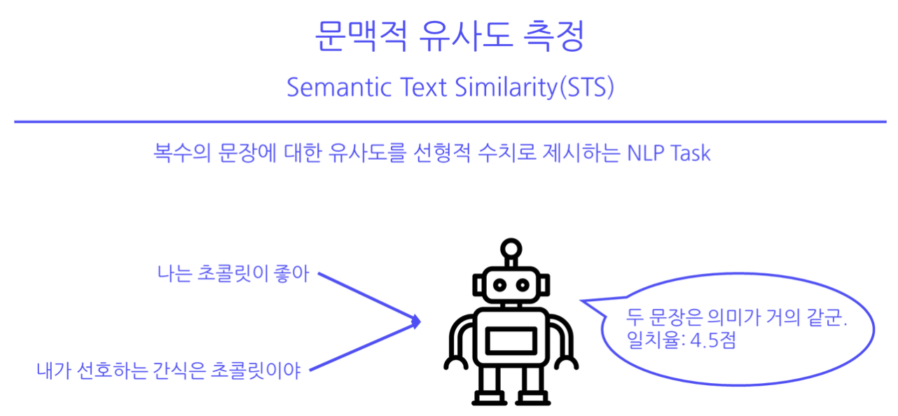
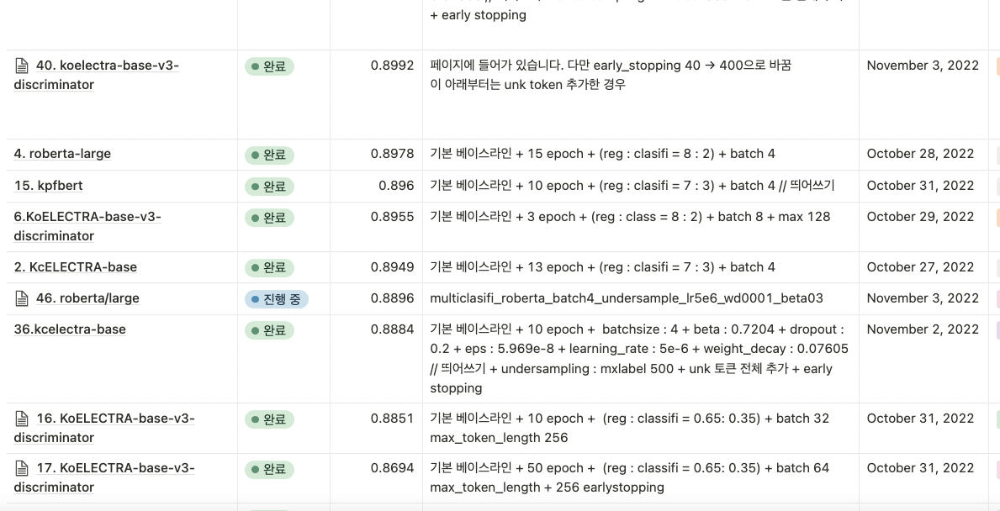

# level1_semantictextsimilarity_nlp-level1-nlp-02


<br>

<br>

### __프로젝트 주제__

컴퓨터로 언어를 이해하는 과정에서 문장에 대한 유사성 판단은 중요한 부분 중 하나이다. 이번 프로젝트는 한국어 문장에 대한 Semantic Text Similarity(이하 STS) 분석으로 한국어 문장의 유사도를 0과 5 사이의 값으로 예측해야 한다.

---

## 🙈 자연어가 뭐조 🙈
부스트 캠프 AI Tech 4기 NLP 2조 <br>
→ 🐿 김현수 🐥 김혜빈 🐷 박승현 🐱 최동민 🦊 홍인희 <br>
Semantic Text Similarity(STS) 대회


<br>

## ✍🏻 __Overview__
### 💡 Problem definition 💡
> STS란 두 텍스트가 얼마나 유사한지 판단하는 NLP Task입니다. <br>일반적으로 두 개의 문장을 입력하고, 이러한 문장쌍이 얼마나 의미적으로 서로 유사한지를 판단합니다.
<p align="center"> 
    
</p>

<br>

### 💡 Project Development Process 💡

- EDA
  - 결측치/데이터 중복 확인
  - 최대 시퀀스 길이 확인
  - binary label & label 별 데이터 분포 확인
  - source(rtt, sampled) 분포 확인

<br>

- 데이터 전처리
  - 띄어쓰기
  - 특수기호 삭제
  - 맞춤법 교정
  - Tokenizer 
  - Oversampling & Undersampling

<br>

- 모델링
  - Hyperparameter Tuning
  - soucre data의 도메인(slack, nsmc, petition)을 나누어 실험하기
  - K Fold

<br>

- 기타
  - 예측 데이터 분석 (Prediction check)
  - 앙상블

<br>

#### 🔸 Model Summary
> KoELECTRA, KcELECTRA, kpfbert, roberta-large, kcbert 등의 다양한 모델을 학습시켰고, 최종적으로 성능이 좋았던 단일 모델들을 앙상블하여 성능을 높였다.

<br>

#### 🔸 Model Selection and Analysis
<p align="center"> 
    
</p>

<br>


### __🐵 프로젝트 총 회고 🐵__

> 베이스라인 모델(koelectra)을 기준으로 다양한 실험들을 해봤는데, 대조군이 없어 명확한 성능 향상의 이유를 찾지 못한 모델들도 꽤나 있었다. 깃허브와 노션을 조금 더 잘 활용했더라면 모델 구조, 데이터 전처리, Undersampling, Tokenizer unk vocab 추가, Hyperparameter Tuning, K Fold, 앙상블 등의 각각의 항목에 대해서 어느 정도의 성능 향상을 보였는지 정리 할 수 있었을 것 같다. 또한 한국어로 된 PLM이 한정되어 있고, 모델의 구조를 바꾸는 것 보단 좋은 데이터를 입력값으로 넣는 것이 훨씬 더 중요하다는 것을 깨달았다. 멘토님께서 말씀해주신 __“Garbage in, Garbage out”__ 이란 말의 의미를 실감할 수 있었고, 다음에는 데이터 전처리에 더욱 힘을 써보고 싶다.

<br>

### 🔸 Project Tree
```bash
level1_semantictextsimilarity_nlp-level1-nlp-02
├── basic_model
│   ├── model
│   │   ├── ModelBase.py  
│   │   └── ModelFullClasifi.py
│   ├── utils
│   │   └── Earlystopping.py
│   ├── Data.py
│   ├── main.py
│   ├── ModelSelection.py
│   ├── Test.py
│   ├── Trainer.py
│   └── run.sh
├── data_space_code
│   └── data_space_pykospacing.ipynb
├── domain
│   ├── model
│   │   ├── ModelBase.py  
│   │   └── ModelFullClasifi.py
│   ├── main.py
│   ├── multi_pt.py
│   └── run.sh
├── pytorch_lightning
│   ├── config
│   │   └── base_config.yaml
│   ├── inference.py
│   ├── requirements.txt
│   ├── train.py
│   └── train.sh
└── README.md
```

## 📒 Wrap Up Report
[Wrap Up Report](https://balanced-sunshine-b47.notion.site/Wrap-Up-7173ce9940ed4da9822a7875e50807b1)
